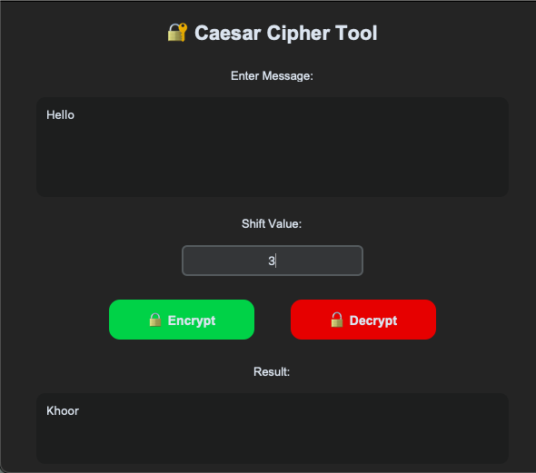

# 🔐 Caesar Cipher Tool (Task 01)

🚀 Built as part of my Cybersecurity Internship at SkillCraft Technology

---

## 📌 Overview

This project is a Python-based application that demonstrates the **Caesar Cipher encryption technique** with an interactive graphical user interface (GUI).

It allows users to securely **encrypt and decrypt messages** using a shift-based substitution method.

---

## ✨ Features

* 🔒 Encrypt text using a custom shift value
* 🔓 Decrypt encrypted messages
* 🖥️ Interactive GUI for easy use
* 🔤 Supports uppercase & lowercase letters
* 🔣 Preserves spaces and special characters

---

## 🧠 How It Works

The Caesar Cipher shifts each letter in the message by a fixed number (called the *shift value*).

### Example

```
Plaintext : HELLO  
Shift     : 3  
Ciphertext: KHOOR  
```

---

## 💻 Tech Stack

* **Python**
* **Tkinter / CustomTkinter (GUI)**

---

## 🚀 Getting Started

### 1️⃣ Clone the Repository

```
git clone https://github.com/akashrajkumar1001/SCT_CS_1.git
```

### 2️⃣ Navigate to the Project Folder

```
cd SCT_CS_1
```

### 3️⃣ Run the Application

```
python main.py
```

---

## 📸 Demo



---

## 📈 Future Improvements

* 🔓 Add brute-force attack simulation
* 🎨 Enhance UI/UX design further
* 🌐 Convert into a web-based application
* 📋 Add copy-to-clipboard functionality

---

## 👨‍💻 Author

**Akash Rajkumar**

